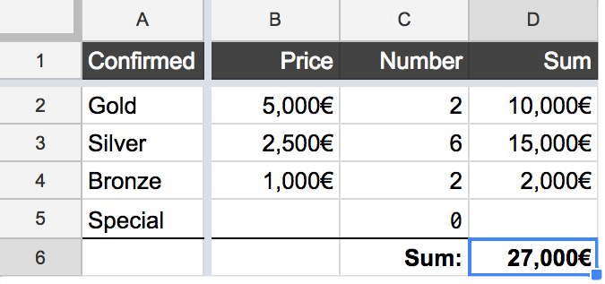

# Sponsoring

After we found a venue the next step is always find sponsors. The reason for this is that we finance the conference only with sponsors and the money from the tickets.

## Sponsors

When we write to sponsors we write them what we offer (Number of participants, topics, number of talks, ...) and attach additionally a standardized cover letter and some promotion slides to the email. We added our latest cover letter to the section [sample letter below.](#sample-letter)

To have an overview of the status of the requests we use a google spreadsheet. At the moment it has the following head lines and information:

| Company name |	Contact name | Contact e-mail |	Addressed on |	Addressed by | Current Status | Additional comment | Invoice sent | Added to website | Tweet sent | Ticket links sent |
|-------|----|-----|-----|-----|-----|-----|----|----|----|-----|
| Awesome Company |	Evelyn Berezin | `evelyn@awesome.com` |	23.1.2017 |	Tina | Confirmed - Gold |  | - | yes | - | - |
| Superduper Company | Edith Clarke | `edith@super.com` |	24.1.2017 |	Tina | Cancelled | Ask them next year again | - | - | - | - |
| Amazing Corporation | Ada Lovelace | `ada@amazing.com` |	24.1.2017 |	Tina | Sent |  | - | - | - | - |
| New Startup | Radia Perlman | `radia@startup.com` |	27.1.2017 |	Tina | Confirmed - Silver | Remind them of sponsoring material | 10.2.2017 | yes | - | 10.2.2017 |

We also use `Conditional Formatting` to count the number of sponsors per level and to highlight the status from the requests.

In another tab we calculate the money we get from the sponsors to have a little overview how much money we already collected.

### Sponsoring plans

#### What do the sponsors get

Depending on the sponsoring level the sponsors get from us different things.

On the one hand they get free tickets and options to buy more tickets (in case we are sold out these tickets are still buyable for the sponsors).

On the other hand they get a lot of opportunities to advertise their company. Depending on the sponsoring level there are a lot of things the companies may do at the venue: put up posters, have booths or stands, give out swag to the attendees.

Also regarding the sponsoring levels there are some things that we as a conference do to promote the sponsors. We thank them in tweets. We mention them in emails and also during the conference.

As they are one of the main reasons the conference can be run you should be grateful for their support and show them that.

#### What do the sponsors provide

The most trivial thing to ask sponsors for is money. As you will read we offered several sponsoring levels to choose from.

Some sponsors ask to provide something special to separate them from others.
Some ideas for these specials are support for:
 - childcare
 - coffee
 - party

And also here you can differentiate between organizing this yourself and hand over the invoice or you trust the sponsor to completely handle this by themselves. The advantage of the latter is less organizational effort for you :). But you have to trust them that they really take care of this.

### Find sponsors

Don't be scared but finding sponsors is an exhausting task with a lot of communication. It is also a very important and refreshing task if you like to organize and talk to people.

#### Use your network

At first: Use your own network to find sponsors. Talk to people in your company if they want to sponsor your event. Then ask friends. If you are a member of a meet-up or community use these connections to advertise your event.

If you already ran a conference ask the sponsors from last year again.

#### Use everything else

It is better to have too much sponsors then too little. If you don't know whom to ask anymore have a look at other conferences or meet-ups near you to have a look at their sponsoring list.

Another thing is to ask for sponsoring or support on social media platforms like twitter to support your event.

------------------------
### Sample letter

*Important!* This was our 4th iteration after 4 years. We started with a much more basic design, mainly text. We have the luck of having a designer in the team, so don't be daunted. In case you are curious, [here is our first version.](material/JSUnconf2014_first_letter.pdf)

This is our latest cover letter for JSUnconf 2017. We sent this along with a set of slides to all our sponsoring requests.

You can find the sample cover letter [here](material/JSUnconf2017_sample_cover_letter.pdf) and the sample slides [here](material/JSUnconf2017_sample_slides.pdf).

The text of the email:

Dear Sponsors,

We are super excited that the 4th JSUnconf will take place in Hamburg in March 2017.

http://2017.jsunconf.eu

About 300 people, both from Germany and abroad, will attend the event. The target group is developers and consultants who use JavaScript, either privately or in their daily work. We as organisers are expecting a return of core developers of well-known frameworks and many familiar names and faces from the JavaScript community.

Facts and figures:
 - 300 - 350 attendees
 - 2 days, 3 parallel tracks
 - 25th and 26th of March in 2017
 - Location: BMK Hamburg
 - ~30 presentations, each lasting 30 minutes
 - Tickets: €59 - €79
 - Language: English

The previous JSUnconf was characterized by a range of high quality sessions covering a wide spectrum of topics (See [JSConf channel](https://www.youtube.com/playlist?list=PL37ZVnwpeshGgaWeK9oFRPIjrLSo8mm6b)). The resulting media coverage was extremely positive and we are expecting a large majority of last year's attendees to be present at the event in 2017.
The Early Bird tickets sale will start in January. Regular Tickets are scheduled for February. Diversity Tickets will be available for underrepresented groups in tech to apply.

Our aim is to hold a stand-out event that is a success for everybody involved. In order to attract as many developers as possible, we want to keep the ticket price as low as possible. As a sponsor, you have the opportunity to present your product and/or yourselves as an attractive employer at the event. The various options are listed below.

| Gold  | Silver | Bronze |      |
|:-------:|:-------:|:------:|-------------------:|
| 5.000 | 2.500  | 1.000  |        Price in € |
| 6     | 10     | 20     | Max # of Sponsors |
| 8     | 4      | 2      |      Free Tickets |
| 4     | 2      | 1      |   Buyable Tickets |
| A1    |  A2    | A3     |       Poster Size |
|||||
| X | X | X | Logo, link and short description on our website |
| X | X | X | Posters, flyers and swag at the venue |
| X | X |  | Naming in emails to delegates |
| X | X |  | Tweet on @jsunconf  |             
| X |  |  |  Booth / stand   |
| X |  |  | Special events    |

Additional Benefits: Sponsors may supply delegates with advertising material and "goodie bags". For example: stickers, pens, bottle openers, stickers, magazines, etc.

We are expecting sponsorship slots to be taken very quickly. Please send us your feedback by begin of February, 2017.

If you have any questions, please feel free to get in touch.

Best regards from the beautiful Hamburg

— Your JSUnconf team
